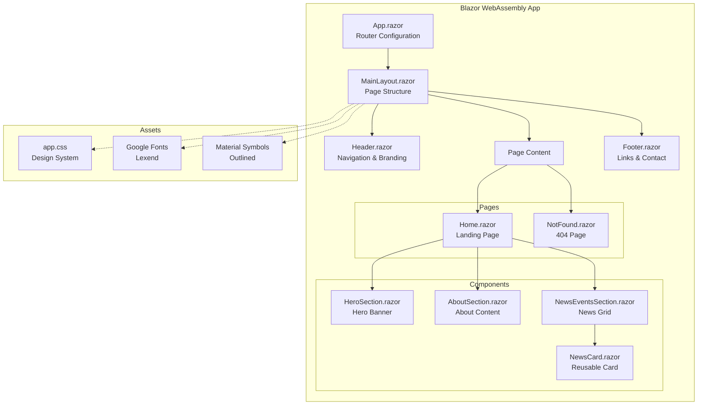

# SSCA-BC Website UI - Architecture Document

## Project Overview

**Project Name:** SSCA-BC Website (South Surrey Christian Assembly 南素里基督教会)  
**Technology:** Blazor WebAssembly (.NET)  
**Project Path:** `website/src/SSCA.website.UI/`

## Summary of Changes

### Initial Development (November 2024)
1. **Created Blazor WebAssembly Project** - Built from HTML/CSS design reference
2. **Implemented Component Architecture** - Modular, reusable Razor components
3. **CSS Design System** - Custom vanilla CSS with variables, dark mode support, responsive breakpoints
4. **Chinese Localization** - Updated branding from English to Chinese (南素里基督教会)
5. **Removed Loading Spinner** - Simplified index.html startup experience
6. **Added .gitignore** - Exclude build artifacts (bin/, obj/, _framework/)

### Content Updates
- Header: "SSCA-BC" with "南素里基督教会" subtitle
- Navigation: Home, 主日信息, 福音聚会, 特别聚会, 联系我们
- Hero: "南素里基督教会" headline
- CTA Buttons: "2025一年读经一遍", "Sunday Bulletin 主日单张"
- Login Button: "登陆"

---

## Architecture Diagram



---

## Project Structure

```
SSCA.website.UI/
├── App.razor                 # Router & app entry point
├── Program.cs                # WebAssembly host configuration
├── _Imports.razor            # Global using statements
├── SSCA_BC.csproj            # Project file
│
├── Layout/
│   ├── MainLayout.razor      # Main page layout (Header + Content + Footer)
│   └── MainLayout.razor.css  # Scoped layout styles
│
├── Pages/
│   ├── Home.razor            # Landing page (/, composes sections)
│   └── NotFound.razor        # 404 error page
│
├── Shared/
│   ├── Header.razor          # Sticky header with nav & branding
│   └── Footer.razor          # Footer with links & contact info
│
├── Components/
│   ├── HeroSection.razor     # Hero banner with background & CTAs
│   ├── AboutSection.razor    # About organization section
│   ├── NewsCard.razor        # Reusable news/event card
│   └── NewsEventsSection.razor # Grid of news cards
│
└── wwwroot/
    ├── index.html            # HTML entry point
    └── css/
        └── app.css           # Complete CSS design system
```

---

## Component Details

### Layout Components

| Component | Purpose | Key Features |
|-----------|---------|--------------|
| **MainLayout** | Page wrapper | Flexbox structure, includes Header & Footer |
| **Header** | Navigation | Sticky header, logo, nav menu, login button, mobile menu |
| **Footer** | Site footer | 3-column grid, social links, contact info, copyright |

### Page Sections

| Component | Purpose | Parameters |
|-----------|---------|------------|
| **HeroSection** | Banner | Background image, headline, description, 2 CTA buttons |
| **AboutSection** | About | Centered text content, "Discover our story" link |
| **NewsEventsSection** | Content grid | Contains 3 NewsCard components |
| **NewsCard** | Reusable card | `ImageUrl`, `Category`, `Title`, `Description`, `Date`, `Link`, `LinkText`, `BadgeClass` |

---

## CSS Design System

### Color Palette
```css
--primary: #137fec      /* Blue - buttons, links, accents */
--accent: #FDB813       /* Gold - event badges */
--background-light: #f6f7f8
--background-dark: #101922
--slate-[50-900]        /* Grayscale range */
```

### Breakpoints
- **Mobile**: < 768px (single column, hidden nav)
- **Tablet**: 768px - 1023px (2-column grid)
- **Desktop**: ≥ 1024px (3-column grid, full nav)

### Key Features
- CSS custom properties for theming
- Dark mode support (`.dark` class)
- Responsive utilities (`.hidden-mobile`, `.hidden-desktop`)
- Smooth transitions and hover effects

---

## Dependencies

| Dependency | Purpose |
|------------|---------|
| **Blazor WebAssembly** | Client-side .NET runtime |
| **Lexend Font** | Google Fonts typography |
| **Material Symbols** | Icon set |

---

## Build & Run

```bash
cd website/src/SSCA.website.UI
dotnet build    # Compile project
dotnet run      # Start dev server at http://localhost:5227
```

---

## Future Enhancements

- [ ] Dark mode toggle button
- [ ] Functional mobile hamburger menu
- [ ] Dynamic content from API/database
- [ ] Additional pages (主日信息, 福音聚会, etc.)
- [ ] User authentication (登陆 functionality)
- [ ] Chinese/English language toggle
