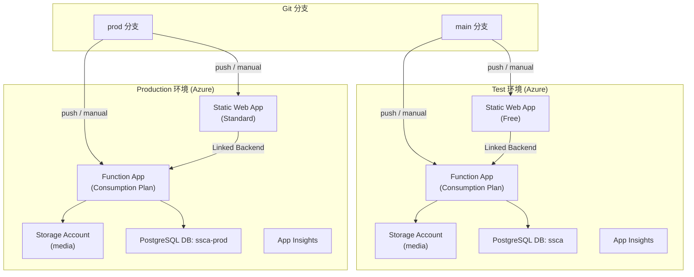
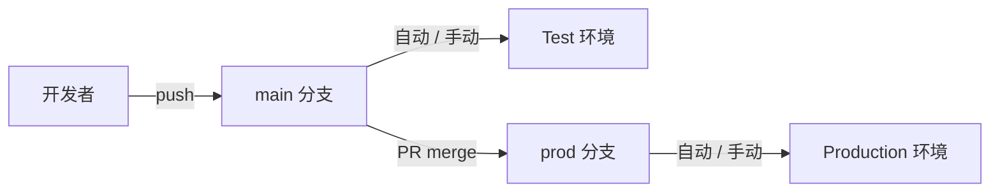

# Multi-Environment Setup: Test + Production (Updated)

## 背景

将当前单一环境拆分为 Test + Production，同时进行三项重大架构升级：

1. ✅ **独立 Azure Function App** 替代 SWA 托管函数
2. ✅ **分支策略**：`main` → Test，`prod` 分支 → Production
3. ✅ **手动触发部署** (`workflow_dispatch`) 支持两个环境

---

## User Review Required

> [!IMPORTANT]
> **独立 Azure Function App**：当前 API 作为 SWA 托管函数运行（由 SWA 自动管理）。改为独立 Function App 后：
> - 优点：独立扩展、Always-on（Standard 计划）、更灵活的配置
> - 影响：额外 Azure 资源成本（Consumption Plan ~$0/月低流量，Standard Plan ~$55/月）
> - 技术：通过 `azurerm_static_web_app_function_app_registration` 将 Function App 链接到 SWA，保持 `/api/*` 路由透明代理

> [!WARNING]
> **现有 State 迁移**：执行本方案前，需手动迁移现有 Terraform state key。具体命令在方案末尾提供。

> [!IMPORTANT]
> **`prod` 分支**：Production 从 `prod` 分支部署。日常开发在 `main`，通过 PR 合并到 `prod` 触发 Production 部署。需要在 GitHub 创建 `prod` 分支。

---

## 整体架构



---

## Proposed Changes

### 1. Terraform 模块重构

新的目录结构：

```
infrastructure/
├── modules/
│   └── ssca-website/
│       ├── main.tf              # required_providers only
│       ├── variables.tf         # 所有输入变量
│       ├── resources.tf         # SWA + Function App + Storage + Insights
│       └── outputs.tf           # 输出值
├── environments/
│   ├── test/
│   │   ├── main.tf              # backend (ssca-website-test.tfstate) + module call
│   │   └── terraform.tfvars     # Test 环境配置
│   └── prod/
│       ├── main.tf              # backend (ssca-website-prod.tfstate) + module call
│       └── terraform.tfvars     # Prod 环境配置
├── bootstrap-state.sh           # 保留不变
└── README.md                    # 更新
```

---

#### [NEW] modules/ssca-website/main.tf

```hcl
terraform {
  required_version = ">= 1.0"
  required_providers {
    azurerm = { source = "hashicorp/azurerm", version = "~> 3.0" }
    random  = { source = "hashicorp/random",  version = "~> 3.0" }
  }
}
```

---

#### [NEW] modules/ssca-website/variables.tf

基于现有 `variables.tf`，新增 Function App 相关变量：

```hcl
# --- 新增变量 ---
variable "function_app_sku" {
  description = "Function App Service Plan SKU (Y1=Consumption, B1=Basic)"
  type        = string
  default     = "Y1"  # Consumption plan
}
```

其余变量从现有 `variables.tf` 迁移，不变。

---

#### [MODIFY] modules/ssca-website/resources.tf

在现有基础上新增以下资源：

```hcl
# ============================================
# Function App Runtime Storage
# ============================================
resource "azurerm_storage_account" "functions" {
  name                     = "${replace(var.project_name, "-", "")}func${random_string.suffix.result}"
  resource_group_name      = azurerm_resource_group.main.name
  location                 = var.location
  account_tier             = "Standard"
  account_replication_type = "LRS"
  tags                     = var.tags
}

# ============================================
# App Service Plan (for Function App)
# ============================================
resource "azurerm_service_plan" "functions" {
  name                = "${var.project_name}-plan-${random_string.suffix.result}"
  resource_group_name = azurerm_resource_group.main.name
  location            = var.location
  os_type             = "Linux"
  sku_name            = var.function_app_sku  # "Y1" for consumption
  tags                = var.tags
}

# ============================================
# Azure Function App (independent)
# ============================================
resource "azurerm_linux_function_app" "api" {
  name                       = "${var.project_name}-api-${random_string.suffix.result}"
  resource_group_name        = azurerm_resource_group.main.name
  location                   = var.location
  service_plan_id            = azurerm_service_plan.functions.id
  storage_account_name       = azurerm_storage_account.functions.name
  storage_account_access_key = azurerm_storage_account.functions.primary_access_key

  site_config {
    application_stack {
      dotnet_version              = "8.0"
      use_dotnet_isolated_runtime = true
    }
    cors {
      allowed_origins = ["https://${azurerm_static_web_app.website.default_host_name}"]
    }
  }

  app_settings = {
    "FUNCTIONS_WORKER_RUNTIME"              = "dotnet-isolated"
    "ConnectionStrings__PostgreSQL"         = "Host=${var.postgres_host};Port=..."
    "ConnectionStrings__AzureStorage"       = azurerm_storage_account.media.primary_connection_string
    "AzureStorage__BaseUrl"                 = trimsuffix(azurerm_storage_account.media.primary_blob_endpoint, "/")
    "APPINSIGHTS_INSTRUMENTATIONKEY"        = azurerm_application_insights.main.instrumentation_key
    "APPLICATIONINSIGHTS_CONNECTION_STRING" = azurerm_application_insights.main.connection_string
  }

  tags = var.tags
}

# ============================================
# Link Function App to Static Web App
# ============================================
resource "azurerm_static_web_app_function_app_registration" "api" {
  static_web_app_id = azurerm_static_web_app.website.id
  function_app_id   = azurerm_linux_function_app.api.id
}
```

同时从 `azurerm_static_web_app.website` 的 `app_settings` 中**移除** `ConnectionStrings__*` 等设置（这些现在在 Function App 上）。

---

#### [NEW] modules/ssca-website/outputs.tf

新增 Function App 相关输出：

```hcl
output "function_app_name" {
  value = azurerm_linux_function_app.api.name
}

output "function_app_url" {
  value = "https://${azurerm_linux_function_app.api.default_hostname}"
}
```

---

#### [NEW] environments/test/main.tf

```hcl
terraform {
  required_version = ">= 1.0"
  required_providers {
    azurerm = { source = "hashicorp/azurerm", version = "~> 3.0" }
    random  = { source = "hashicorp/random",  version = "~> 3.0" }
  }
  backend "azurerm" {
    storage_account_name = "hwtfstate"
    container_name       = "tfstate"
    key                  = "ssca-website-test.tfstate"
    resource_group_name  = "terraform-state-rg"
  }
}

provider "azurerm" {
  features {
    resource_group { prevent_deletion_if_contains_resources = false }
  }
}
provider "random" {}

module "ssca_website" {
  source = "../../modules/ssca-website"

  project_name        = var.project_name
  environment         = var.environment
  location            = var.location
  resource_group_name = var.resource_group_name
  # ... all other variables passed through
}
```

#### [NEW] environments/test/terraform.tfvars

```hcl
project_name        = "ssca-bc-test"
environment         = "test"
location            = "centralus"
resource_group_name = "ssca-bc-test-rg"

postgres_host          = "shared-data.postgres.database.azure.com"
postgres_database_name = "ssca"          # 现有数据库

static_web_app_sku = "Free"
function_app_sku   = "Y1"               # Consumption

tags = {
  Project     = "SSCA-BC Website"
  Environment = "Test"
  ManagedBy   = "Terraform"
}
```

#### [NEW] environments/prod/terraform.tfvars

```hcl
project_name        = "ssca-bc-prod"
environment         = "prod"
location            = "centralus"
resource_group_name = "ssca-bc-prod-rg"

postgres_host          = "shared-data.postgres.database.azure.com"
postgres_database_name = "ssca-prod"     # 新数据库

static_web_app_sku = "Standard"
function_app_sku   = "Y1"               # Consumption (升级 B1 如需 Always-on)

tags = {
  Project     = "SSCA-BC Website"
  Environment = "Production"
  ManagedBy   = "Terraform"
}
```

---

#### [DELETE] 旧的根级文件

迁移到模块/环境后删除：
- `infrastructure/main.tf`
- `infrastructure/variables.tf`
- `infrastructure/resources.tf`
- `infrastructure/outputs.tf`
- `infrastructure/terraform.tfvars`
- `infrastructure/terraform.tfvars.example`
- `infrastructure/prod.auto.tfvars`

---

### 2. CI/CD 工作流改造

#### [MODIFY] azure-static-web-apps.yml → 拆分为两个工作流

##### [NEW] deploy-test.yml

```yaml
name: Deploy Test Environment

on:
  push:
    branches: [main]
    paths: ['src/**']
  workflow_dispatch:          # ← 手动触发

jobs:
  build:
    runs-on: ubuntu-latest
    steps:
      - uses: actions/checkout@v4
      - uses: actions/setup-dotnet@v4
        with: { dotnet-version: '8.0.x' }
      - name: Build UI
        run: |
          cd src/SSCA.website.UI
          dotnet publish -c Release -o ../../output/wwwroot
      - name: Build API
        run: |
          cd src/SSCA.website.API
          dotnet publish -c Release -o ../../output/api
      - uses: actions/upload-artifact@v4
        with: { name: build-output, path: output/ }

  deploy-swa:
    needs: build
    runs-on: ubuntu-latest
    environment: test
    steps:
      - uses: actions/download-artifact@v4
        with: { name: build-output, path: output/ }
      - uses: Azure/static-web-apps-deploy@v1
        with:
          azure_static_web_apps_api_token: ${{ secrets.SWA_DEPLOY_TOKEN }}
          action: "upload"
          app_location: "output/wwwroot/wwwroot"
          skip_app_build: true
          skip_api_build: true

  deploy-api:
    needs: build
    runs-on: ubuntu-latest
    environment: test
    steps:
      - uses: actions/download-artifact@v4
        with: { name: build-output, path: output/ }
      - uses: azure/login@v2
        with:
          creds: ${{ secrets.AZURE_CREDENTIALS }}
      - name: Deploy Function App
        uses: Azure/functions-action@v1
        with:
          app-name: ${{ secrets.FUNCTION_APP_NAME }}
          package: output/api
```

##### [NEW] deploy-prod.yml

```yaml
name: Deploy Production Environment

on:
  push:
    branches: [prod]          # ← prod 分支
    paths: ['src/**']
  workflow_dispatch:          # ← 手动触发
    inputs:
      confirm:
        description: 'Type "deploy" to confirm production deployment'
        required: true

jobs:
  build:
    runs-on: ubuntu-latest
    steps:
      # 同 Test 的 build steps

  deploy-swa:
    needs: build
    runs-on: ubuntu-latest
    environment: production   # ← GitHub Environment 保护
    steps:
      - uses: Azure/static-web-apps-deploy@v1
        with:
          azure_static_web_apps_api_token: ${{ secrets.SWA_DEPLOY_TOKEN }}
          # ...

  deploy-api:
    needs: build
    runs-on: ubuntu-latest
    environment: production
    steps:
      - uses: Azure/functions-action@v1
        with:
          app-name: ${{ secrets.FUNCTION_APP_NAME }}
          # ...
```

---

#### [MODIFY] terraform-deploy.yml → 拆分为两个

##### [NEW] terraform-test.yml

```yaml
name: Terraform Test

on:
  push:
    branches: [main]
    paths: ['infrastructure/**']
  workflow_dispatch:

env:
  TF_WORKING_DIR: infrastructure/environments/test

jobs:
  terraform:
    environment: test
    runs-on: ubuntu-latest
    defaults:
      run: { working-directory: ${{ env.TF_WORKING_DIR }} }
    steps:
      # init, plan, apply
      - name: Update GitHub Environment Secrets
        run: |
          terraform output -raw static_web_app_api_key | gh secret set SWA_DEPLOY_TOKEN --env test
          echo "$(terraform output -raw function_app_name)" | gh secret set FUNCTION_APP_NAME --env test
```

##### [NEW] terraform-prod.yml

```yaml
name: Terraform Production

on:
  push:
    branches: [prod]
    paths: ['infrastructure/**']
  workflow_dispatch:

env:
  TF_WORKING_DIR: infrastructure/environments/prod

jobs:
  terraform:
    environment: production
    # ... same steps but for prod
```

#### [DELETE] 旧工作流

- `.github/workflows/azure-static-web-apps.yml`
- `.github/workflows/terraform-deploy.yml`

---

### 3. 分支策略



一次性操作：
1. 从 `main` 创建 `prod` 分支
2. 在 GitHub 仓库设置中创建 `test` 和 `production` Environments
3. 为每个 Environment 配置 secrets

---

### 4. GitHub Environments 和 Secrets

| 环境 | GitHub Environment | Secrets 需要配置 |
|------|--------------------|------------------|
| Test | `test` | `SWA_DEPLOY_TOKEN`、`FUNCTION_APP_NAME`、`AZURE_CREDENTIALS`、`ARM_ACCESS_KEY`、`POSTGRES_USERNAME`、`POSTGRES_PASSWORD` |
| Prod | `production` | 同上（不同values）+ Optional: Required Reviewers |

---

### 5. State 迁移步骤（手动执行一次）

现有 state key 为 `ssca-website.tfstate`，需要重命名为 Test 环境的 key：

```bash
# 1. 在 Azure Storage 中复制 state blob
az storage blob copy start \
  --account-name hwtfstate \
  --destination-container tfstate \
  --destination-blob "ssca-website-test.tfstate" \
  --source-container tfstate \
  --source-blob "ssca-website.tfstate" \
  --account-key "$ARM_ACCESS_KEY"

# 2. 验证复制成功后，在新的 test 目录中 terraform init
cd infrastructure/environments/test
terraform init

# 3. 验证 state 正确加载
terraform plan  # 应显示变更（新增 Function App 资源）

# 4. 确认无误后，删除旧 state blob
az storage blob delete \
  --account-name hwtfstate \
  --container-name tfstate \
  --name "ssca-website.tfstate" \
  --account-key "$ARM_ACCESS_KEY"
```

---

## Open Questions

> [!IMPORTANT]
> 1. **Function App Plan**：两个环境都用 Consumption (Y1, 按调用计费, ~$0低流量) 可以吗？Production 是否需要 Basic (B1, ~$55/月, 支持 Always-on 无冷启动)？
> 2. **Production 数据库**：确认用 `ssca-prod` 作为 Production 数据库名？需要你在共享 PostgreSQL 上手动创建。
> 3. **`prod` 分支保护规则**：是否需要设置 `prod` 分支为 protected branch（只允许通过 PR 合并）？

---

## Verification Plan

### Automated Tests
1. `terraform validate` — 对 `modules/ssca-website/`、`environments/test/`、`environments/prod/` 分别验证
2. `terraform plan` — test 环境（应显示新增 Function App 相关资源）
3. `terraform plan` — prod 环境（应显示全新资源创建）

### Manual Verification
1. Test SWA URL 仍可访问（现有资源不受影响）
2. Function App 独立部署成功，`/api/*` 通过 Linked Backend 代理正常
3. 两个工作流的 `workflow_dispatch` 手动触发可用
4. `prod` 分支 push 仅触发 Production 部署
5. `main` 分支 push 仅触发 Test 部署
