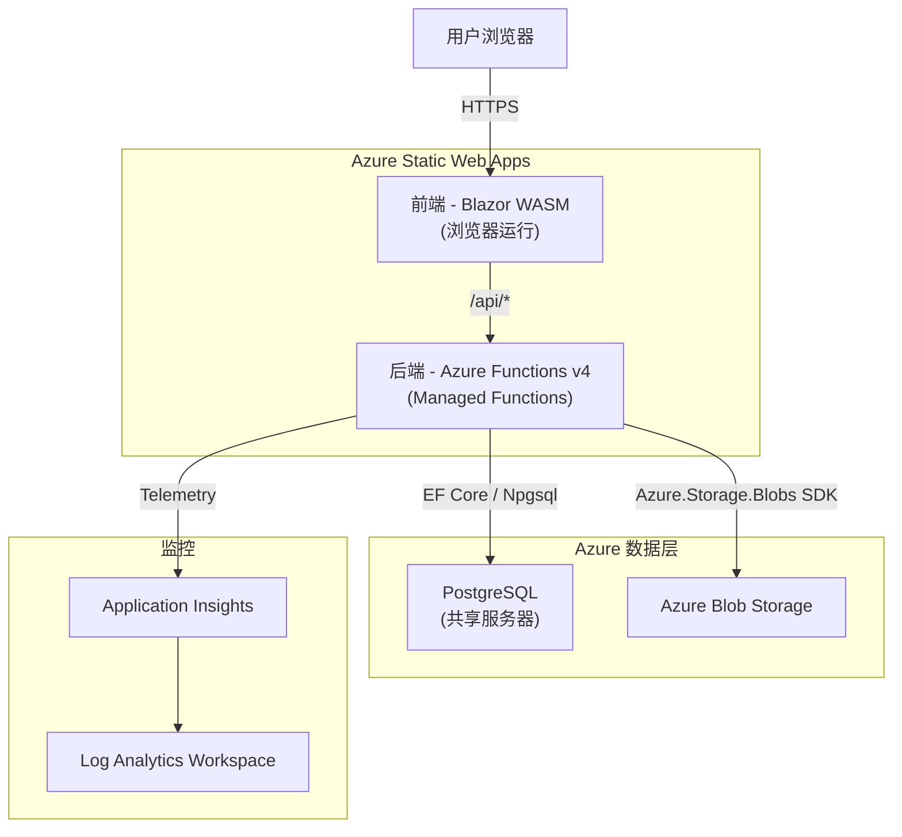
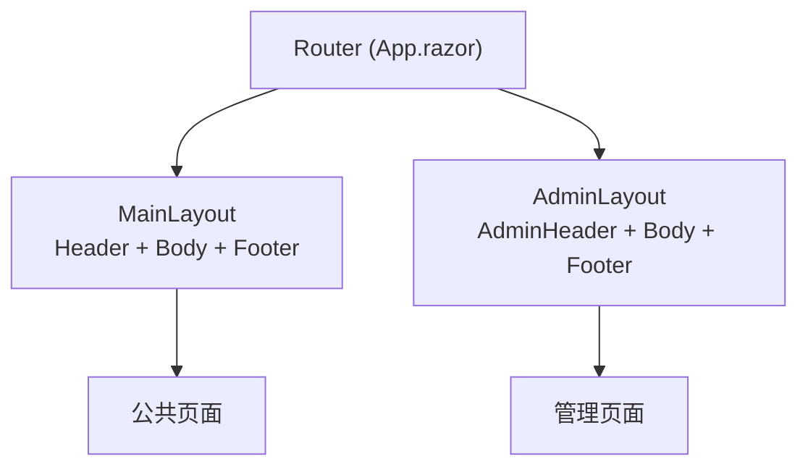
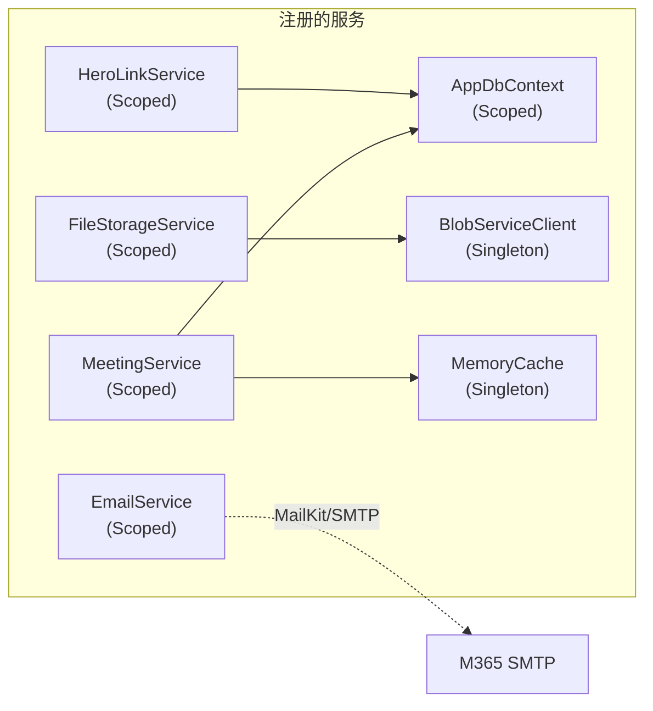
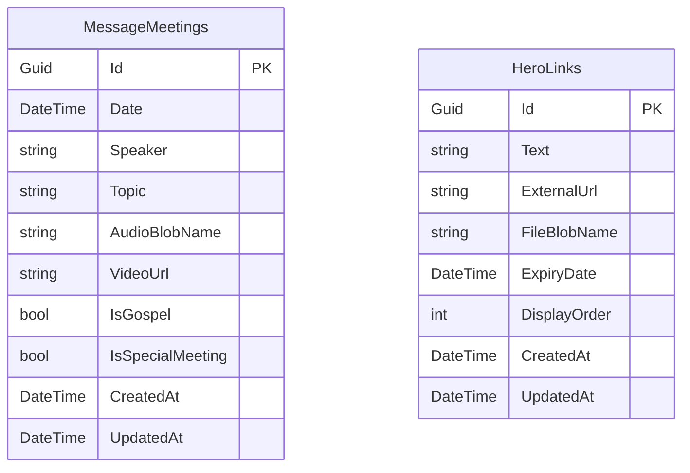
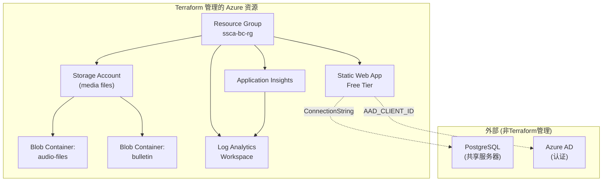
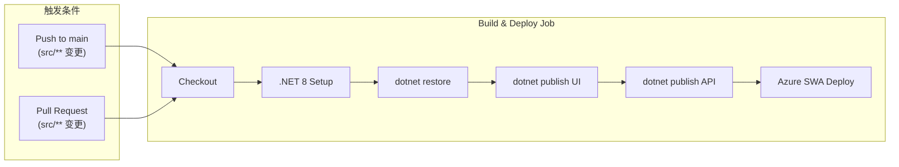
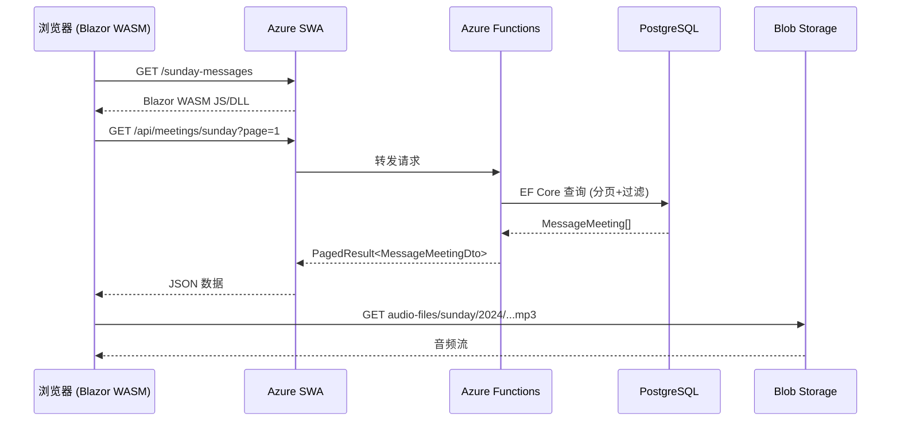
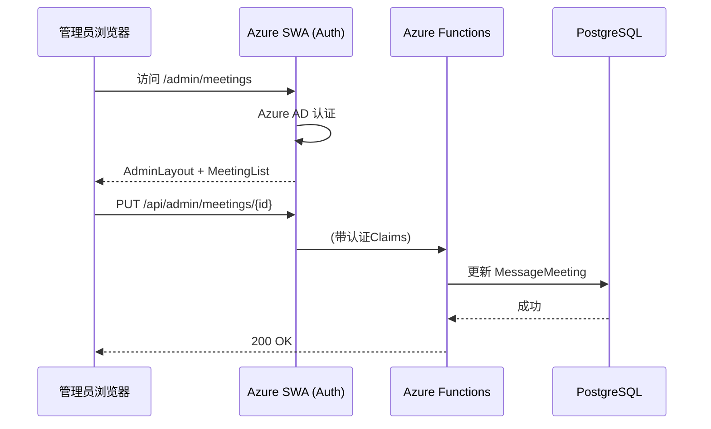

# SSCA 网站架构分析

> 生成日期: 2026-04-17

---

## 1. 整体架构

项目采用 **Azure Static Web Apps (SWA)** 托管模式，前后端分离但同一仓库部署：



**关键特点**：Azure SWA 将 Blazor WASM 静态文件和 Azure Functions API 统一部署，前端通过 `/api/` 路径代理自动路由到后端。

---

## 2. 项目结构

```
website/
├── src/
│   ├── SSCA.website.sln                  # Visual Studio 解决方案
│   ├── SSCA.website.UI/                  # 🖥️ 前端 (Blazor WASM)
│   ├── SSCA.website.API/                 # ⚙️ 后端 (Azure Functions)
│   └── SSCA.website.Shared/              # 📦 共用DTO/Models
├── infrastructure/                        # 🏗️ Terraform IaC
├── tools/
│   └── SSCA.DataMigration/               # 🔄 数据迁移工具
├── design/                                # 📐 设计文档 (11个功能)
├── docs/                                  # 📚 文档
└── .github/workflows/                     # 🚀 CI/CD
```

---

## 3. 前端架构 (SSCA.website.UI)

### 技术栈
| 项 | 值 |
|----|-----|
| 框架 | **Blazor WebAssembly** (.NET 8) |
| 渲染模式 | Client-side (浏览器运行) |
| UI库 | **无** (纯CSS手写) |
| 路由 | Blazor Router (`App.razor`) |
| HTTP通信 | `HttpClient` (基址自动) |
| 状态管理 | 无集中式 (组件内管理) |

### 布局体系


- [MainLayout.razor](file:///c:/Projects/HaoWang-SSCA/website/src/SSCA.website.UI/Layout/MainLayout.razor) — 公共站点布局
- [AdminLayout.razor](file:///c:/Projects/HaoWang-SSCA/website/src/SSCA.website.UI/Layout/AdminLayout.razor) — 后台管理布局（独立Header）

### 页面清单

| 页面 | 路由 | 布局 | 文件 |
|------|------|------|------|
| 首页 | `/` | MainLayout | [Home.razor](file:///c:/Projects/HaoWang-SSCA/website/src/SSCA.website.UI/Pages/Home.razor) |
| 主日信息 | `/sunday-messages` | MainLayout | [SundayMessages.razor](file:///c:/Projects/HaoWang-SSCA/website/src/SSCA.website.UI/Pages/SundayMessages.razor) |
| 福音聚会 | `/gospel-meetings` | MainLayout | [GospelMeetings.razor](file:///c:/Projects/HaoWang-SSCA/website/src/SSCA.website.UI/Pages/GospelMeetings.razor) |
| 特别聚会 | `/special-meetings` | MainLayout | [SpecialMeetings.razor](file:///c:/Projects/HaoWang-SSCA/website/src/SSCA.website.UI/Pages/SpecialMeetings.razor) |
| 联系我们 | `/contact` | MainLayout | [Contact.razor](file:///c:/Projects/HaoWang-SSCA/website/src/SSCA.website.UI/Pages/Contact.razor) |
| 聚会列表 | `/admin/meetings` | AdminLayout | [MeetingList.razor](file:///c:/Projects/HaoWang-SSCA/website/src/SSCA.website.UI/Pages/Admin/MeetingList.razor) |
| 聚会编辑 | `/admin/meetings/edit/{id}` | AdminLayout | [MeetingEdit.razor](file:///c:/Projects/HaoWang-SSCA/website/src/SSCA.website.UI/Pages/Admin/MeetingEdit.razor) |
| 周报上传 | `/admin/bulletin` | AdminLayout | [BulletinUpload.razor](file:///c:/Projects/HaoWang-SSCA/website/src/SSCA.website.UI/Pages/Admin/BulletinUpload.razor) |
| Hero链接管理 | `/admin/hero-links` | AdminLayout | [HeroLinkManagement.razor](file:///c:/Projects/HaoWang-SSCA/website/src/SSCA.website.UI/Pages/Admin/HeroLinkManagement.razor) |

### 组件 (首页)

| 组件 | 功能 | 大小 |
|------|------|------|
| [HeroSection.razor](file:///c:/Projects/HaoWang-SSCA/website/src/SSCA.website.UI/Components/HeroSection.razor) | 主横幅 + 动态行动链接 | 9KB |
| [WeeklyMeetingsSection.razor](file:///c:/Projects/HaoWang-SSCA/website/src/SSCA.website.UI/Components/WeeklyMeetingsSection.razor) | 每周聚会时间表 | 11KB |
| [ContactSection.razor](file:///c:/Projects/HaoWang-SSCA/website/src/SSCA.website.UI/Components/ContactSection.razor) | 联系表单 | 9KB |
| [AboutSection.razor](file:///c:/Projects/HaoWang-SSCA/website/src/SSCA.website.UI/Components/AboutSection.razor) | 教会简介 | 2KB |
| [NewsEventsSection.razor](file:///c:/Projects/HaoWang-SSCA/website/src/SSCA.website.UI/Components/NewsEventsSection.razor) | 新闻和活动 | 2KB |
| [NewsCard.razor](file:///c:/Projects/HaoWang-SSCA/website/src/SSCA.website.UI/Components/NewsCard.razor) | 新闻卡片 | 1KB |

### 前端服务
| 服务 | 用途 |
|------|------|
| [SpeakerService.cs](file:///c:/Projects/HaoWang-SSCA/website/src/SSCA.website.UI/Services/SpeakerService.cs) | 讲员数据缓存（注册为 Singleton） |

---

## 4. 后端架构 (SSCA.website.API)

### 技术栈
| 项 | 值 |
|----|-----|
| 运行时 | **Azure Functions v4** (Isolated Worker) |
| .NET版本 | .NET 8 |
| ORM | **Entity Framework Core 8** + Npgsql |
| 数据库 | PostgreSQL（共享服务器） |
| 存储 | Azure Blob Storage (`Azure.Storage.Blobs 12.19`) |
| 邮件 | MailKit 4.14 (M365 SMTP) |
| 监控 | Application Insights |

### DI 依赖注入体系



### API 端点

| Function | HTTP | Route | 认证 | 功能 |
|----------|------|-------|------|------|
| GetSundayMessages | GET | `/api/meetings/sunday` | Anonymous | 主日信息列表（分页+搜索） |
| GetGospelMeetings | GET | `/api/meetings/gospel` | Anonymous | 福音聚会列表 |
| GetSpecialMeetings | GET | `/api/meetings/special` | Anonymous | 特别聚会列表 |
| GetMeetingById | GET | `/api/meetings/{id}` | Anonymous | 单条聚会详情 |
| GetSpeakers | GET | `/api/meetings/speakers` | Anonymous | 讲员列表（支持类型过滤） |
| AdminMeetings* | CRUD | `/api/admin/meetings/*` | (SWA Auth) | 管理端聚会增删改查 |
| Bulletin* | GET/POST | `/api/bulletin/*` | Mixed | 周报文件上传和代理 |
| Contact | POST | `/api/contact` | Anonymous | 联系表单提交 |
| HeroLinks* | CRUD | `/api/hero-links/*` | Mixed | Hero链接管理 |

### 后端服务层

| 服务 | 接口 | 文件 | 职责 |
|------|------|------|------|
| MeetingService | IMeetingService | [MeetingService.cs](file:///c:/Projects/HaoWang-SSCA/website/src/SSCA.website.API/Services/MeetingService.cs) (8.5KB) | 聚会CRUD、搜索、分页、讲员缓存 |
| EmailService | IEmailService | [EmailService.cs](file:///c:/Projects/HaoWang-SSCA/website/src/SSCA.website.API/Services/EmailService.cs) (7.5KB) | M365 SMTP邮件发送 |
| FileStorageService | IFileStorageService | [FileStorageService.cs](file:///c:/Projects/HaoWang-SSCA/website/src/SSCA.website.API/Services/FileStorageService.cs) (2.4KB) | Azure Blob 文件上传/下载 |
| HeroLinkService | IHeroLinkService | [HeroLinkService.cs](file:///c:/Projects/HaoWang-SSCA/website/src/SSCA.website.API/Services/HeroLinkService.cs) (3.7KB) | Hero链接CRUD |

---

## 5. 数据模型

### 数据库表 (PostgreSQL)



### 共享 DTO (Shared 项目)

| DTO | 用途 |
|-----|------|
| [MessageMeetingDto.cs](file:///c:/Projects/HaoWang-SSCA/website/src/SSCA.website.Shared/Models/MessageMeetingDto.cs) | 聚会数据传输对象 |
| [CreateMeetingRequest.cs](file:///c:/Projects/HaoWang-SSCA/website/src/SSCA.website.Shared/Models/CreateMeetingRequest.cs) | 新建聚会请求 |
| [UpdateMeetingRequest.cs](file:///c:/Projects/HaoWang-SSCA/website/src/SSCA.website.Shared/Models/UpdateMeetingRequest.cs) | 更新聚会请求 |
| [MeetingSearchQuery.cs](file:///c:/Projects/HaoWang-SSCA/website/src/SSCA.website.Shared/Models/MeetingSearchQuery.cs) | 搜索参数 |
| [PagedResult.cs](file:///c:/Projects/HaoWang-SSCA/website/src/SSCA.website.Shared/Models/PagedResult.cs) | 分页结果包装 |
| [HeroLinkDto.cs](file:///c:/Projects/HaoWang-SSCA/website/src/SSCA.website.Shared/Models/HeroLinkDto.cs) | Hero链接DTO |
| [ContactMessageDto.cs](file:///c:/Projects/HaoWang-SSCA/website/src/SSCA.website.Shared/Models/ContactMessageDto.cs) | 联系消息DTO |

---

## 6. 基础设施 (Terraform)



| 配置 | 值 |
|------|-----|
| 区域 | `centralus` |
| SWA SKU | Free |
| Storage | Standard LRS |
| Monitoring | Application Insights + Log Analytics (30天保留) |
| 认证 | Azure AD (可选配置) |

---

## 7. CI/CD 流水线



**特点**：
- 只在 `src/**` 路径变更时触发（基础设施变更不触发）
- 预构建 + `skip_app_build`/`skip_api_build` — SWA Action 不再重复构建
- Terraform 有独立的 [terraform-deploy.yml](file:///c:/Projects/HaoWang-SSCA/website/.github/workflows/terraform-deploy.yml) 工作流

---

## 8. 数据流

### 公共用户访问聚会



### 管理员编辑聚会



---

## 9. 架构评估

### ✅ 优点

| 方面 | 评价 |
|------|------|
| **部署模型** | SWA 一站式托管前后端，简单高效，Free Tier 降低成本 |
| **前后端分离** | Shared 项目共享 DTO，类型安全 |
| **数据库自动迁移** | API 启动时自动 `Database.Migrate()`，减少部署步骤 |
| **IaC** | Terraform 管理基础设施，可重复部署 |
| **数据迁移** | 增量同步 + 断点续传，处理旧数据迁移需求 |
| **双布局** | 公共站/管理后台独立布局，关注点分离 |

### ⚠️ 可改进的地方

| 方面 | 现状 | 建议 |
|------|------|------|
| **单元测试** | ❌ 无测试项目 | 添加 xUnit 测试项目覆盖 Services 层 |
| **错误处理** | 各 Function 分散处理 | 添加全局异常中间件 |
| **前端状态管理** | 组件内管理，无集中化 | 随页面增多考虑引入 Fluxor 或自定义状态容器 |
| **前端 HTTP 调用** | 各页面直接 HttpClient | 提取到专用 ApiService 层 |
| **CSS 组织** | 分散在各 `.razor.css` | 建立设计系统 / 主题变量 |
| **日志结构** | API 有 App Insights，前端无 | 前端添加 JS 异常捕获 |
| **缓存策略** | MemoryCache 仅讲员数据 | 扩展到聚会列表缓存 |
| **SWA 认证** | AAD 可选配置 | 确保管理端路由强制认证 |
| **数据库模型** | 仅 2 张表 | 需要为后续功能（诗歌、小组等）扩展 |
| **环境隔离** | 仅 prod 配置 | 添加 staging 环境用于测试 |

---

## 10. 总结

项目架构是一个典型的 **Azure Static Web Apps + Blazor WASM + Azure Functions** 全栈方案。对于教会小型网站来说，这个架构选择合理——部署简单、成本低、类型安全。当前核心功能完善，但随着 `requirements.md` 中规划的功能扩展（诗歌库、小组管理、儿童故事等），建议优先：

1. **添加测试项目** — 防止新功能引入回归
2. **提取前端 API 服务层** — 避免 HttpClient 调用重复
3. **扩展数据库模型** — 为新功能预设表结构
4. **添加 staging 环境** — CI/CD 支持预览部署
