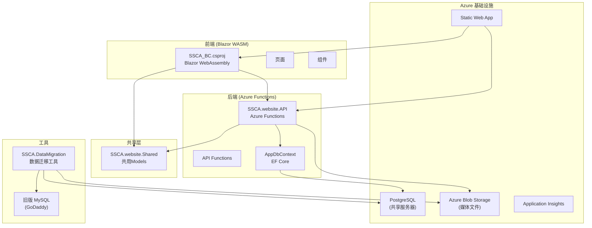

# SSCA 网站项目状态报告

> 生成日期: 2026-04-17

## 项目概述

SSCA (教会) 网站从旧版 PHP 站点迁移到新的 **Blazor WebAssembly** 架构，部署在 **Azure Static Web Apps** 上，后端使用 **Azure Functions**。

---

## 架构总览

---

## 已完成的功能 ✅

### 前端页面 (6个公共页面 + 4个管理页面)

| 页面 | 文件 | 状态 |
|------|------|------|
| 首页 | `Home.razor` | ✅ 完成 |
| 主日信息 | `SundayMessages.razor` | ✅ 完成 |
| 福音聚会 | `GospelMeetings.razor` | ✅ 完成 |
| 特别聚会 | `SpecialMeetings.razor` | ✅ 完成 |
| 联系我们 | `Contact.razor` | ✅ 完成 |
| 404页面 | `NotFound.razor` | ✅ 完成 |

### 管理后台

| 功能 | 文件 | 状态 |
|------|------|------|
| 聚会列表管理 | `Admin/MeetingList.razor` | ✅ 完成 |
| 聚会编辑 | `Admin/MeetingEdit.razor` | ✅ 完成 |
| 周报上传 | `Admin/BulletinUpload.razor` | ✅ 完成 |
| Hero链接管理 | `Admin/HeroLinkManagement.razor` | ✅ 完成 |

### 首页组件

| 组件 | 状态 |
|------|------|
| HeroSection (主横幅 + 动态链接) | ✅ 完成 |
| AboutSection (教会简介) | ✅ 完成 |
| WeeklyMeetingsSection (每周聚会时间) | ✅ 完成 |
| NewsEventsSection (新闻活动) | ✅ 完成 |
| ContactSection (联系表单) | ✅ 完成 |

### 后端 API Functions (5个)

| Function | 功能 | 状态 |
|----------|------|------|
| `MeetingsFunction` | 公共聚会数据查询 | ✅ 完成 |
| `AdminMeetingsFunction` | 管理端聚会 CRUD | ✅ 完成 |
| `BulletinFunction` | 周报文件代理 | ✅ 完成 |
| `ContactFunction` | 联系表单 + M365 邮件发送 | ✅ 完成 |
| `HeroLinksFunction` | Hero链接 CRUD | ✅ 完成 |

### 基础设施 (Terraform)

| 资源 | 状态 |
|------|------|
| Azure Resource Group | ✅ 已配置 |
| Azure Static Web App | ✅ 已配置 |
| Azure Storage Account (媒体文件) | ✅ 已配置 |
| Blob容器: `audio-files` + `bulletin` | ✅ 已配置 |
| Application Insights + Log Analytics | ✅ 已配置 |
| PostgreSQL (共享服务器) | ✅ 已配置 |

### CI/CD

| 工作流 | 状态 |
|--------|------|
| `azure-static-web-apps.yml` | ✅ 已配置 |
| `terraform-deploy.yml` | ✅ 已配置 |

### 数据库迁移 (EF Core Migrations)

| Migration | 状态 |
|-----------|------|
| `20251225191747_Initial` (MessageMeetings表) | ✅ 已应用 |
| `20260126052104_AddHeroLinks` (HeroLinks表) | ✅ 已应用 |

---

## 数据迁移工具 🔄

`tools/SSCA.DataMigration` — 从旧版 PHP 站点迁移数据

| 功能 | 状态 |
|------|------|
| MySQL → PostgreSQL 数据迁移 | ✅ 已实现 |
| 音频文件 → Azure Blob 迁移 | ✅ 已实现 |
| 增量同步 + 断点续传 | ✅ 已实现 |
| Speaker 名称映射 | ✅ 已配置 |
| 进度文件 (`migration_progress.json` 258KB) | ✅ 已有运行记录 |

---

## 待完成/规划中的功能 📋

根据 `.kiro/specs/data-migration/requirements.md` 中的需求规格，以下功能仍在规划中：

### 未实现的需求

| 需求 | 描述 | 状态 |
|------|------|------|
| 需求2 | 儿童圣经故事 (儿童圣经故事页面 + 音频播放) | ❌ 未开始 |
| 需求3 | 赞美诗选 (搜索 + 歌词显示 + 中英文支持) | ❌ 未开始 |
| 需求4 | 管理功能 (小组管理、会员追踪、服事排班) | ❌ 未开始 |
| 需求8 | 数据验证和质量保证 (迁移验证报告) | ❌ 未开始 |
| 需求9 | 性能优化 (分页、缓存、索引优化) | ⚠️ 部分完成 (已有分页) |
| 需求10 | 用户体验连续性 (URL重定向、保持旧站结构) | ⚠️ 部分完成 |

---

## 项目统计

| 指标 | 数值 |
|------|------|
| 总提交数 | **115** |
| 活跃分支 | `main` (唯一分支) |
| 解决方案项目数 | 3 (UI + API + Shared) + 1 (迁移工具) |
| 最近提交 | 文档更新、Footer样式、管理端讲员管理 |
| 设计文档数 | 11 个功能设计目录 |

---

## 总结

项目核心功能已经**基本完成**：网站前端、聚会管理后台、数据迁移工具、Azure基础设施和CI/CD都已就位。当前处于**功能扩展阶段**，主要待完成工作是 `.kiro/specs` 中定义的数据迁移需求——儿童圣经故事、赞美诗选、小组/会员管理等新功能模块。
